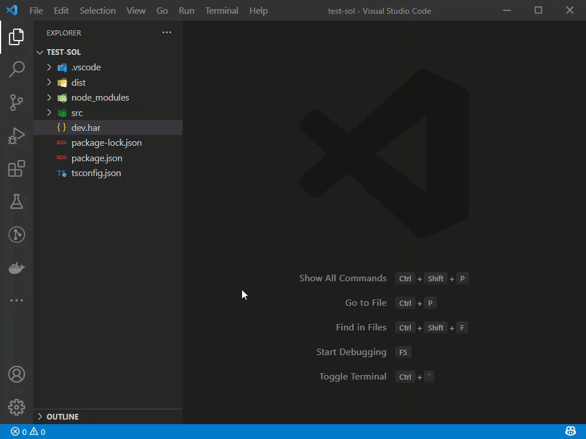

# har-to-api-doc

Blocked by slow backend request/response processing or just want to focus on frontend.

This extension converts HAR file to json-server files, which can be used as mock server. 

- Open a browser and navigate around your webapp and download the HAR file. 
- Use this extension to generate json-server files (https://www.npmjs.com/package/json-server) from the HAR file. 
- Start the server with the generated json-server files.

  

#  Features

Open the `har` file and (`Ctrl+Shift+P` or `Cmd+Shift+P`)> API Doc: Generate Json Server Files. A new folder `json-server` will be created under the project root.

### Run json-server

- Navigate to the json-server folder, do `npm i` and `npm run start`.
- GET calls are handled via `db.json` file. 
- Separate files for each http method are created such as `POST.json`, `PUT.json` that will return the responses to avoid the issue of json-server overwriting the responses.
- Asset requests such as js/css/png calls are not included.

 

# Release Notes

### 0.0.1
 
- Generate json-server files from har file.

  